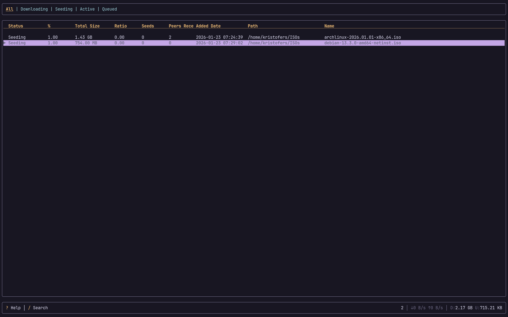
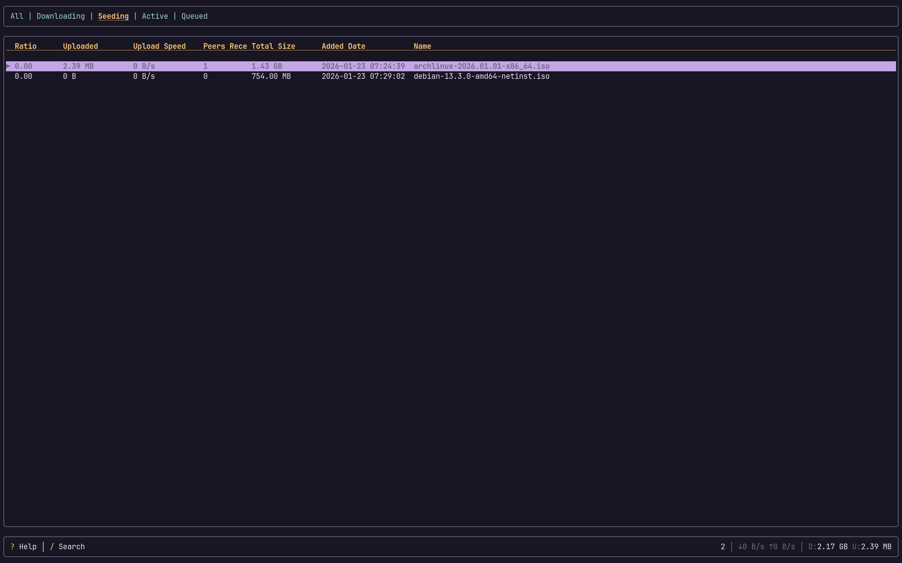

# Traxor

A terminal UI for managing Transmission torrents.

## Features

- Vim-style navigation (`hjkl`)
- Live fuzzy search/filter
- Custom tab layouts with configurable columns
- Multi-select for batch operations
- Move, rename, delete torrents
- Real-time transfer statistics
- Fully configurable keybinds and colors

## Screenshots

| All torrents | Seeding torrents |
|:--:|:--:|
|  |  |

## Installation

```bash
cargo binstall traxor
```

Or build from source:

```bash
git clone https://github.com/kristoferssolo/traxor
cd traxor
cargo build --release
```

## Usage

Make sure Transmission daemon is running, then:

```bash
traxor
```

### Keybinds

| Key | Action |
|-----|--------|
| `j/k` | Navigate up/down |
| `h/l` | Previous/next tab |
| `1-9, 0` | Switch to tab |
| `Enter` | Start/stop torrent |
| `a` | Start/stop all |
| `Space` | Multi-select |
| `m` | Move torrent |
| `r` | Rename torrent |
| `d` | Delete torrent |
| `D` | Delete with data |
| `/` | Search/filter |
| `Esc` | Close popup / clear filter |
| `?` | Toggle help |
| `q` | Quit |

## Configuration

Configuration file: `~/.config/traxor/config.toml`

Only specify values you want to override. See [config/default.toml](config/default.toml) for all options.

### Custom Tabs

```toml
[[tabs]]
name = "My Tab"
columns = ["status", "progress", "name", "size"]
statuses = ["Downloading", "QueuedToDownload"]
```

Available columns: `name`, `status`, `size`, `downloaded`, `uploaded`, `ratio`, `progress`, `eta`, `peers`, `seeds`, `leeches`, `downspeed`, `upspeed`, `path`, `added`, `done`, `left`, `queue`, `error`, `labels`, `tracker`, `hash`, `private`, `stalled`, `finished`, `files`, `activity`
Available statuses: `Stopped`, `QueuedToVerify`, `Verifying`, `QueuedToDownload`, `Downloading`, `QueuedToSeed`, `Seeding`

### Colors

```toml
[colors]
highlight_background = "#3a3a5a"
highlight_foreground = "white"
status_downloading = "cyan"
status_seeding = "white"
status_stopped = "dark_gray"
```

### Time

```toml
[time]
date_format = "%Y-%m-%d %H:%M"
eta_format = "compact"
```

`date_format` uses chrono strftime syntax and is rendered in local time. `eta_format` accepts `compact` or `seconds`.

### Keybinds

```toml
[keybinds]
quit = "q"
next_torrent = "j"
prev_torrent = "k"
filter = "/"
```

## License

Licensed under either of [Apache License, Version 2.0](LICENSE-APACHE) or [MIT license](LICENSE-MIT) at your option.
